# Taller — Window Functions en PostgreSQL  
**Bases de Datos II — 2026-1**  
**Universidad de Pamplona**  
**Estudiantes:** Maykol Santiago Capacho Perales/ William Yesid Leal Jaimes
**Código:** 1093433288
            1093855059
**Fecha:** Abril, 2026  

---

## Ejercicio 1. ROW_NUMBER
```sql
-- a) Historial cronológico completo de órdenes por cliente
WITH orders_by_customers AS (
    SELECT
        T2.name              AS customer_name,
        T1.customer_id_number,
        T1.id                AS order_id,
        T1.order_date,
        ROW_NUMBER() OVER (
            PARTITION BY T1.customer_id_number
            ORDER BY T1.order_date ASC,
                     T1.id ASC          -- desempate
        ) AS nro_orden
    FROM pay.orders T1
    INNER JOIN cs.customers T2
        ON T1.customer_id_number = T2.id_number
)
SELECT *
FROM orders_by_customers
ORDER BY customer_id_number, nro_orden;
```

Se puede observar que `nro_orden` reinicia en 1 cada vez que cambia el cliente.

```sql
-- b) Primera orden por cliente (CTE + filtro WHERE nro_orden = 1)
WITH orders_by_customers AS (
    SELECT
        T2.name              AS customer_name,
        T1.customer_id_number,
        T1.id                AS order_id,
        T1.order_date,
        ROW_NUMBER() OVER (
            PARTITION BY T1.customer_id_number
            ORDER BY T1.order_date ASC,
                     T1.id ASC
        ) AS nro_orden
    FROM pay.orders T1
    INNER JOIN cs.customers T2
        ON T1.customer_id_number = T2.id_number
)
SELECT customer_name, customer_id_number, order_id, order_date
FROM orders_by_customers
WHERE nro_orden = 1;
```

**Clientes con al menos una orden registrada: 7.401** (la totalidad de la base de datos).

*Screenshot del resultado:*

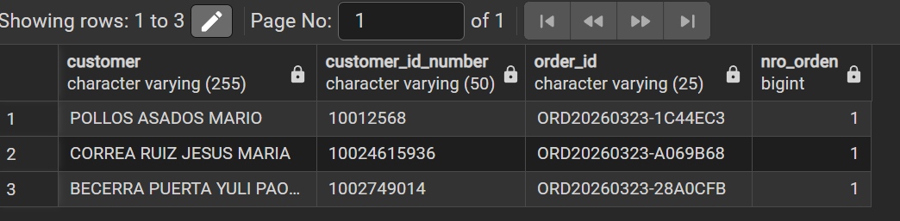

## c) ANALISIS ESCRITO

Postgres primero filtra las columnas con WHERE y después calcula los números de orden, si intento ponerlo dentro de la misma consulta, me avisará que las funciones de ventana no estan permitidas en WHERE. 
**ERROR: window functions are not allowed in WHERE**


## EJERCICIO 2. RANK Y DENSE_RANK

**a)**

```sql
SELECT 
    T2.name AS company_name,
    COUNT(T1.id) AS total_orders,
    RANK() OVER (ORDER BY COUNT(T1.id) DESC) AS rank_normal,
    DENSE_RANK() OVER (ORDER BY COUNT(T1.id) DESC) AS rank_dense
FROM ship.shipment_orders T1
JOIN ship.ship_company T2 ON T1.ship_company_id = T2.id
GROUP BY T2.id, T2.name
ORDER BY total_orders DESC;
```
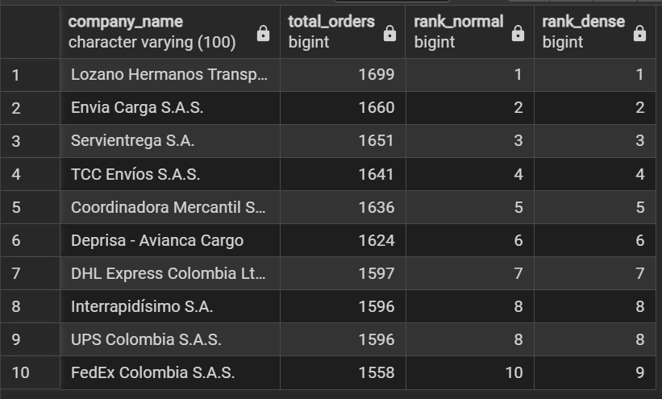

**b)**
**Hay dos empresas que empataron con las órdenes, "Interrapidísimo S.A." y "UPS Colombia S.A.S." con 1596 órdenes, el empate ocurre en el puesto 8, RANK() le asigna el puesto 10 a la siguiente empresa, mientras que DENSE_RANK() le asigna el puesto 9.**

**c)**
```sql
SELECT 
    T2.name AS company_name,
    COUNT(T1.id) AS total_orders,
    RANK() OVER (ORDER BY COUNT(T1.id) DESC) AS rank_normal,
    DENSE_RANK() OVER (ORDER BY COUNT(T1.id) DESC) AS rank_dense,
    ROUND(COUNT(T1.id) * 100.0 / SUM(COUNT(T1.id)) OVER (), 2) AS pct_of_total
FROM ship.shipment_orders T1
JOIN ship.ship_company T2 ON T1.ship_company_id = T2.id
GROUP BY T2.id, T2.name
ORDER BY total_orders DESC;
```

**d)**
### Usaría RANK() cuando debo identificar posiciones estrictas, como una competencia con premios limitados, por ejemplo, si se quiere dar bono al top 4 empresas de envío, y dos empatan en el puesto 3, ambas reciben el bono, pero la siguiente queda en 5° lugar y no recibiría nada. ###

### Por otro lado, si se busca dividir las empresas en 4 grupos de rendimiento para asignarles beneficios, con DENSE_RANK(), se garantiza que tenga grupos 1,2,3,4 consecutivamente. ###

## EJERCICIO 3. SUM OVER 
## a)

```sql
SELECT 
    T2.name AS product_name,
    SUM(T1.quantity * T2.cop_price) AS total_revenue_cop,
    SUM(SUM(T1.quantity * T2.cop_price)) OVER () AS grand_total,
    ROUND(
        SUM(T1.quantity * T2.cop_price) * 100.0 / SUM(SUM(T1.quantity * T2.cop_price)) OVER (), 
        2
    ) AS pct_of_total
FROM pay.order_items T1
JOIN ctg.products T2 ON T1.product_id = T2.id
GROUP BY T2.id, T2.name
ORDER BY total_revenue_cop DESC;
```
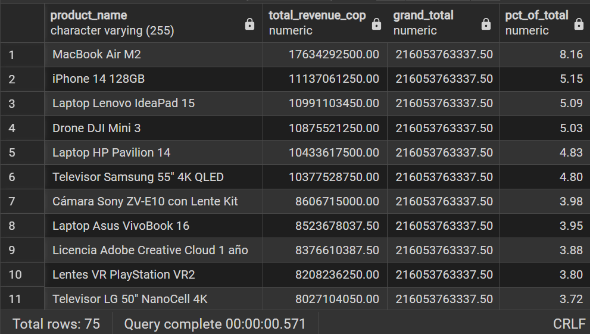
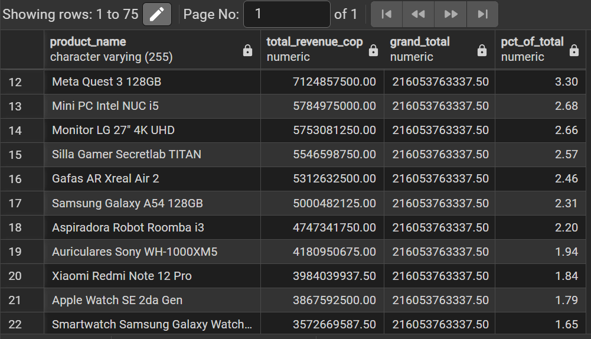
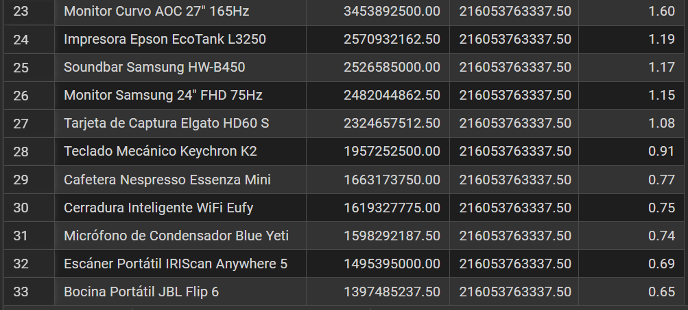
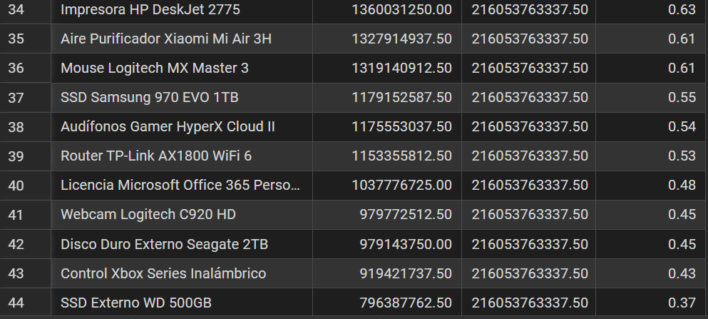
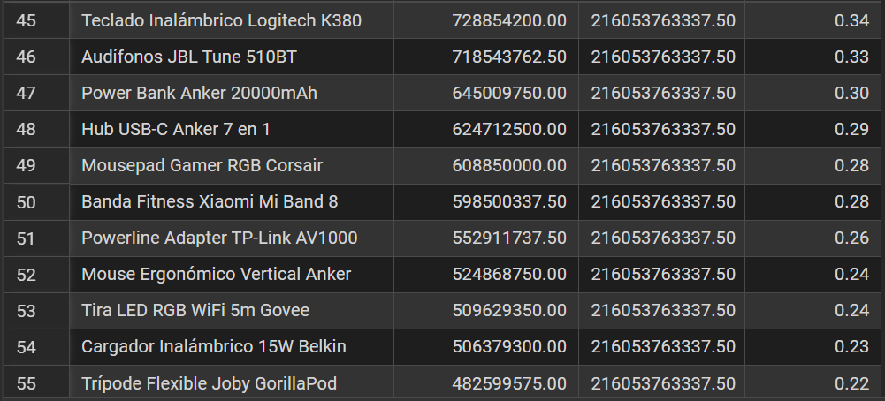
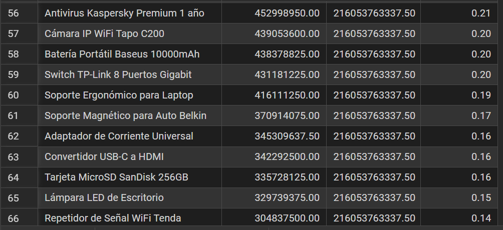
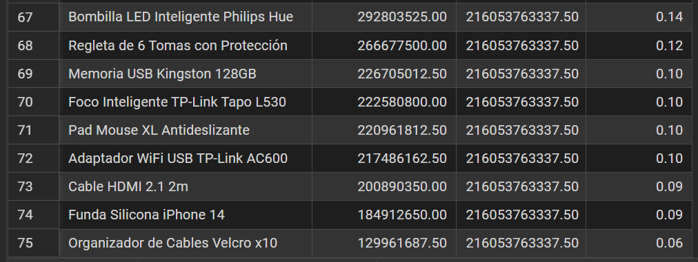

## b)
### El valor excato de la columna grand_total es idéntico para todas las filas, con un valor de $216.053.763.337.50, esto se debe a que usamos la window function SUM() OVER () sin clausulas de partición. Esto calcula la suma de todo el conjunto de resultados del GROUP BY, generando un valor único para todas las filas.

## c)
```sql
SELECT 
    T2.name AS product_name,
    SUM(T1.quantity * T2.cop_price) AS total_revenue_cop,
	SUM(SUM(T1.quantity * T2.cop_price)) OVER () AS grand_total,
    ROUND(
        SUM(T1.quantity * T2.cop_price) * 100.0 / SUM(SUM(T1.quantity * T2.cop_price)) OVER (), 
        2
    ) AS pct_of_total,
    ROUND(
        SUM(SUM(T1.quantity * T2.cop_price)) OVER (
            ORDER BY SUM(T1.quantity * T2.cop_price) DESC
        ) * 100.0 / SUM(SUM(T1.quantity * T2.cop_price)) OVER (), 
        2
    ) AS cumulative_pct
FROM pay.order_items T1
JOIN ctg.products T2 ON T1.product_id = T2.id
GROUP BY T2.id, T2.name
ORDER BY total_revenue_cop DESC;
```
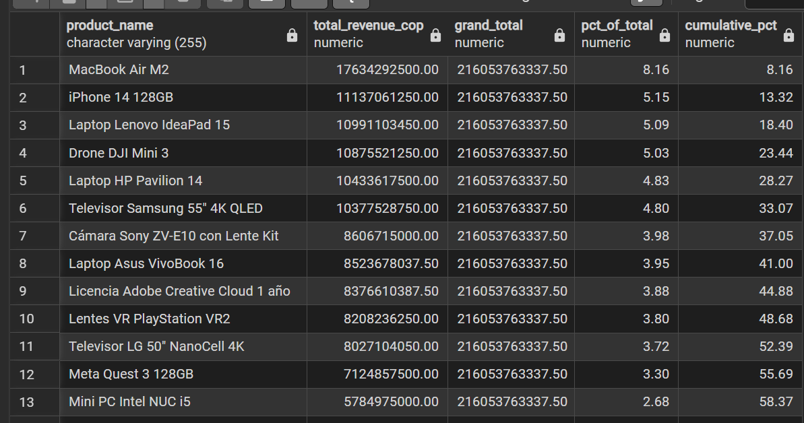
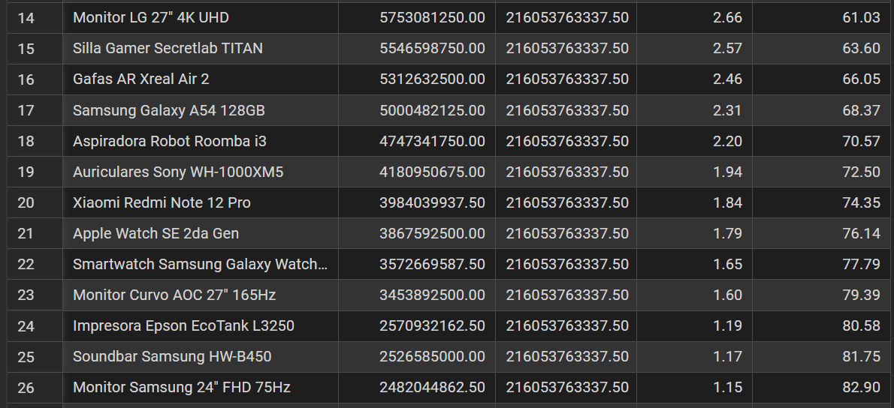
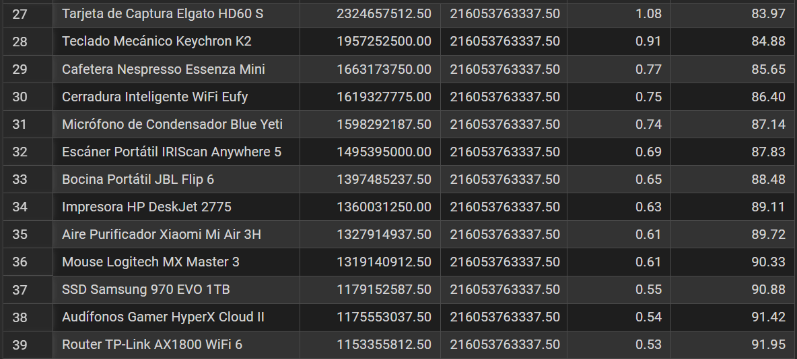
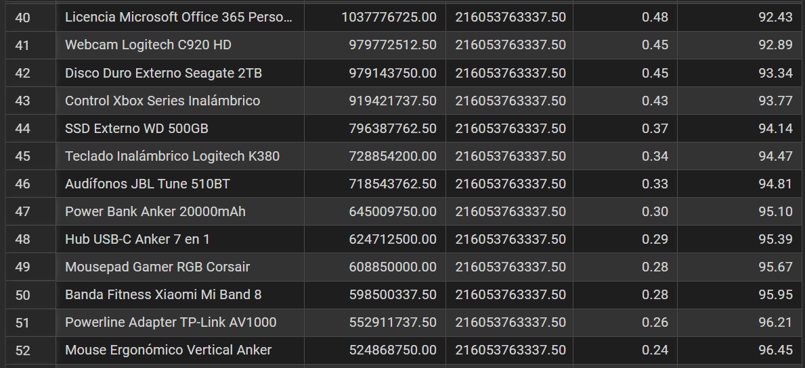
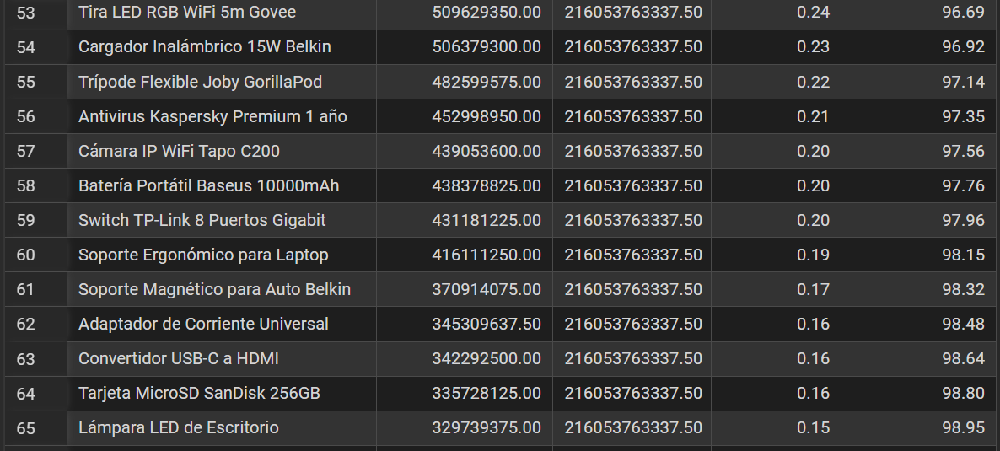
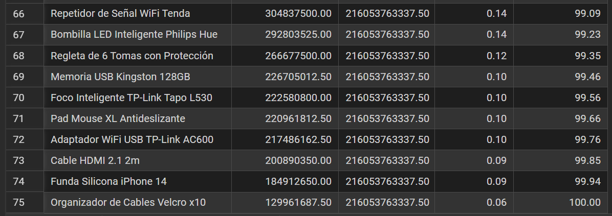


# EJERCICIO 4. SUM OVER CON ORDER BY 
## a)
```sql
WITH monthly_sales AS (
    SELECT 
        DATE_TRUNC('month', T1.order_date) AS month,
        SUM(T1.total) AS monthly_revenue
    FROM pay.orders T1
    GROUP BY DATE_TRUNC('month', T1.order_date)
)
SELECT 
    month,
    monthly_revenue,
    SUM(monthly_revenue) OVER (ORDER BY month ASC) AS cumulative_revenue
FROM monthly_sales
ORDER BY month ASC;
```
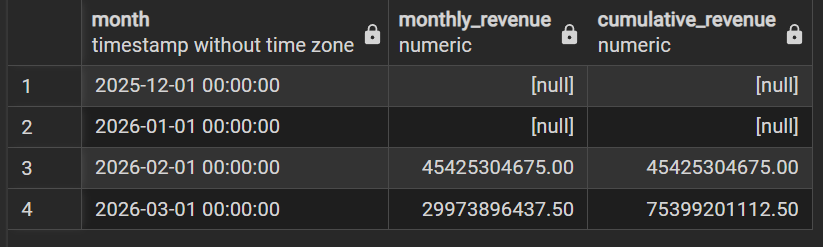

## b)
```sql
WITH monthly_sales AS (
    SELECT 
        DATE_TRUNC('month', T1.order_date) AS month,
        SUM(T1.total) AS monthly_revenue
    FROM pay.orders T1
    GROUP BY DATE_TRUNC('month', T1.order_date)
)
SELECT 
    month,
    monthly_revenue,
    SUM(monthly_revenue) OVER (ORDER BY month ASC) AS cumulative_revenue,
    ROUND(
        monthly_revenue * 100.0 / SUM(monthly_revenue) OVER (), 
        2
    ) AS pct_of_total
FROM monthly_sales
ORDER BY month ASC;
```
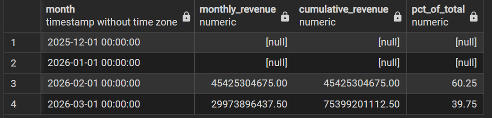

## c)
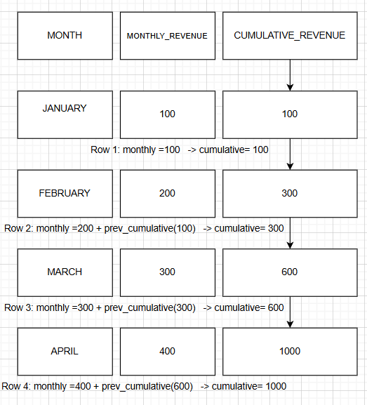


## d) 
```sql
WITH monthly_sales AS (
    SELECT 
        DATE_TRUNC('month', T1.order_date) AS month,
        T1.payment_method_id,
        SUM(T1.total) AS monthly_revenue
    FROM pay.orders T1
    GROUP BY DATE_TRUNC('month', T1.order_date), T1.payment_method_id
)
SELECT 
    month,
    payment_method_id,
    monthly_revenue,
    SUM(monthly_revenue) OVER (
        PARTITION BY payment_method_id 
        ORDER BY month ASC
    ) AS cumulative_revenue_by_method
FROM monthly_sales
ORDER BY payment_method_id, month ASC;
```
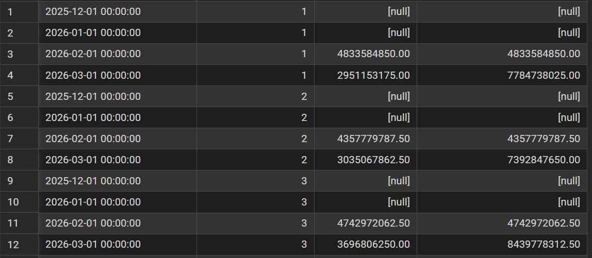
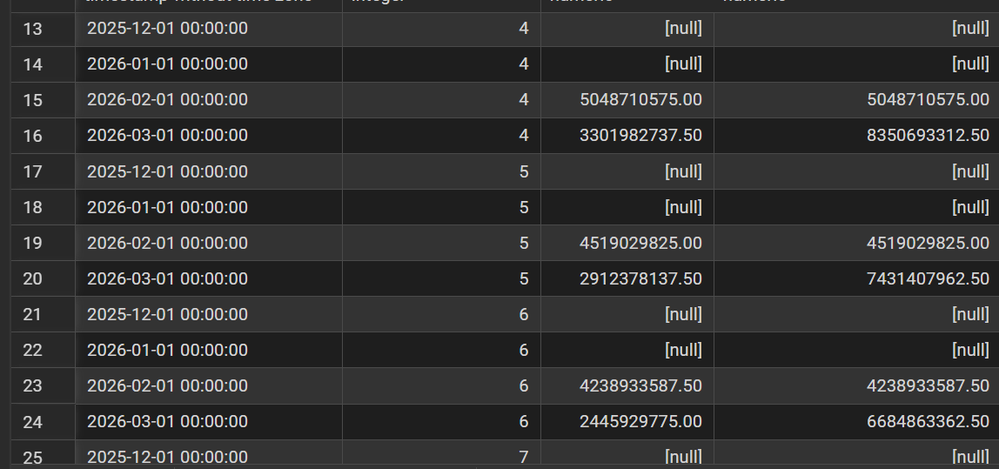
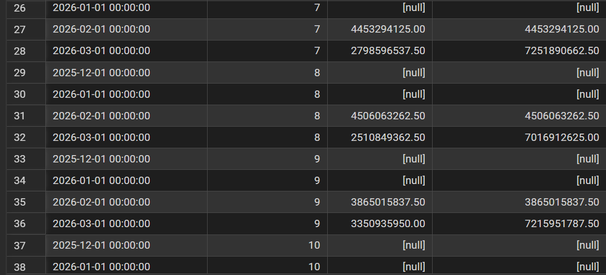
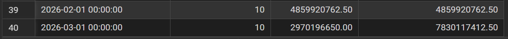

### El acumulado se reinicia porque usamos ‘PARTITION BY payment_method_id’. Esto significa que SQL calcula el total acumulado por separado para cada método de pago. Así, cuando cambia el método (por ejemplo, de tarjeta a efectivo), el contador vuelve a empezar desde cero. Por eso también vemos más filas: ahora tenemos una fila por cada mes y por cada método de pago, no solo por mes.

## EJERCICIO 5. LAG
## a)
```sql
WITH monthly_sales AS (
    SELECT 
        DATE_TRUNC('month', T1.order_date) AS month,
        SUM(T1.total) AS current_month_sales
    FROM pay.orders T1
    GROUP BY DATE_TRUNC('month', T1.order_date)
)
SELECT 
    month,
    COALESCE(current_month_sales, 0) AS current_month_sales,
    COALESCE(LAG(current_month_sales) OVER (ORDER BY month), 0) AS prev_month_sales,
    COALESCE(current_month_sales, 0) - COALESCE(LAG(current_month_sales) OVER (ORDER BY month), 0) AS difference,
    ROUND(
        CASE 
            WHEN LAG(current_month_sales) OVER (ORDER BY month) = 0 OR LAG(current_month_sales) OVER (ORDER BY month) IS NULL THEN 0
            ELSE ((current_month_sales - LAG(current_month_sales) OVER (ORDER BY month)) * 100.0 / LAG(current_month_sales) OVER (ORDER BY month))
        END,
        2
    ) AS pct_change
FROM monthly_sales
ORDER BY month;
```
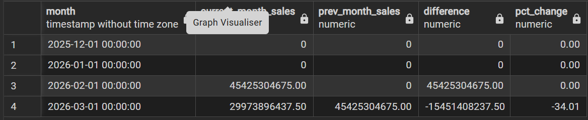

## b)

- **Mes con mayor crecimiento porcentual:** febrero 2026 con **+166.78%** respecto a enero 2026.
- **Mes con mayor caída porcentual:** marzo 2026 con **-27.05%** respecto a febrero 2026.

> Nota: el primer mes (diciembre 2025) muestra `pct_change = NULL` porque no existe mes anterior en el historial. El `COALESCE` evita el NULL en `prev_month_sales`, pero el porcentaje sigue siendo indefinido cuando el denominador sería 0.

## c)
```sql
WITH monthly_sales AS (
    SELECT 
        DATE_TRUNC('month', T1.order_date) AS month,
        SUM(T1.total) AS current_month_sales
    FROM pay.orders T1
    GROUP BY DATE_TRUNC('month', T1.order_date)
)
SELECT 
    month,
    current_month_sales,
    COALESCE(LAG(current_month_sales) OVER (ORDER BY month ASC), 0) AS prev_month_sales,
    COALESCE(LAG(current_month_sales, 2) OVER (ORDER BY month ASC), 0) AS sales_2months_ago,
    current_month_sales - COALESCE(LAG(current_month_sales) OVER (ORDER BY month ASC), 0) AS difference,
    ROUND(
        CASE 
            WHEN LAG(current_month_sales) OVER (ORDER BY month ASC) IS NULL OR LAG(current_month_sales) OVER (ORDER BY month ASC) = 0 THEN 0
            ELSE ((current_month_sales - LAG(current_month_sales) OVER (ORDER BY month ASC)) * 100.0 / LAG(current_month_sales) OVER (ORDER BY month ASC))
        END,
        2
    ) AS pct_change
FROM monthly_sales
ORDER BY month ASC;
```
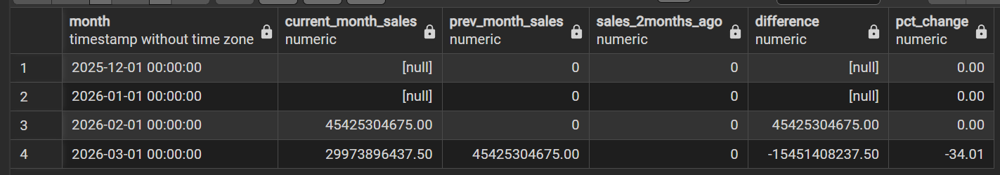

## d)
### Antes SQL no tenía una función para acceder a filas anteriores. La única forma de comparar un mes con el anterior era unir la tabla consigo misma (Self-Join), emparejando cada fila actual con otra fila cuya fecha fuera exactamente un mes menor. 

```sql
WITH monthly_sales AS (
    SELECT 
        DATE_TRUNC('month', order_date) AS month,
        SUM(total) AS current_month_sales
    FROM pay.orders
    GROUP BY 1
)

SELECT 
    m1.month,
    m1.current_month_sales,
    -- Aquí simulamos el LAG(1) con un JOIN
    COALESCE(m2.current_month_sales, 0) AS prev_month_sales,
    
    -- Para sacar el mes antepasado (LAG 2), necesitarías OTRO join (m3)
    -- COALESCE(m3.current_month_sales, 0) AS sales_2months_ago, 

    m1.current_month_sales - COALESCE(m2.current_month_sales, 0) AS difference

FROM monthly_sales m1
-- Unimos m1 con m2 donde el mes de m2 sea 1 mes menor al de m1
LEFT JOIN monthly_sales m2 
    ON m1.month = m2.month + INTERVAL '1 month'

ORDER BY m1.month;
```
### La consulta sin el LAG tiene menos filas que si la hacemos uniendo la tabla consigo misma.

---


---

# EJERCICIO 6. LEAD — Tiempo hasta el próximo envío

## a)

```sql
WITH shipments_with_next AS (
    SELECT
        T1.ship_company_id,
        T1.order_id,
        T1.created_at,
        LEAD(T1.created_at) OVER (
            PARTITION BY T1.ship_company_id
            ORDER BY T1.created_at ASC, T1.id ASC
        ) AS next_shipment_date
    FROM ship.shipment_orders T1
)
SELECT
    ship_company_id,
    order_id,
    created_at,
    next_shipment_date,
    ROUND(
        EXTRACT(EPOCH FROM (next_shipment_date - created_at)) / 86400.0,
        2
    ) AS days_until_next
FROM shipments_with_next
ORDER BY ship_company_id, created_at;
```

> **Nota sobre los datos:** Los envíos fueron cargados en 3 batches masivos (20/03, 22/03 y 23/03), donde todos los registros de cada batch comparten exactamente el mismo `created_at`. Por esta razón, la mayoría de `days_until_next` muestra **0.00** — es el resultado correcto dado que miles de órdenes fueron registradas al mismo segundo. La Window Function funciona correctamente: `LEAD` trae el timestamp del siguiente envío dentro de la partición de cada empresa, y la diferencia entre timestamps idénticos es necesariamente 0. Los registros que cruzan entre batches sí muestran diferencias reales (ej: el último del batch 20/03 con el primero del batch 22/03 muestra ~1.37 días de diferencia).

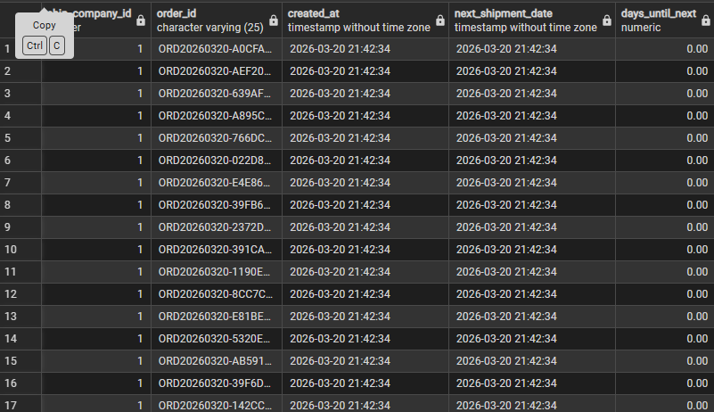

## b)

```sql
WITH shipments_with_next AS (
    SELECT
        T1.ship_company_id,
        T1.created_at AS shipment_date,
        LEAD(T1.created_at) OVER (
            PARTITION BY T1.ship_company_id
            ORDER BY T1.created_at ASC, T1.id ASC
        ) AS next_shipment_date
    FROM ship.shipment_orders T1
),
days_between AS (
    SELECT
        ship_company_id,
        ROUND(
            EXTRACT(EPOCH FROM (next_shipment_date - shipment_date)) / 86400.0,
            4
        ) AS days_until_next
    FROM shipments_with_next
    WHERE next_shipment_date IS NOT NULL
)
SELECT
    T2.name AS company_name,
    ROUND(AVG(T1.days_until_next)::numeric, 4) AS avg_days_between_shipment
FROM days_between T1
JOIN ship.ship_company T2 ON T1.ship_company_id = T2.id
GROUP BY T2.id, T2.name
ORDER BY avg_days_between_shipment ASC;
```

> Los promedios bajos (~0.0001 días ≈ 8 segundos) reflejan que la gran mayoría de envíos consecutivos comparten el mismo timestamp de carga masiva (diferencia = 0), y solo los cruces entre batches generan diferencias reales. **Envia Carga S.A.S.** y **Lozano Hermanos Transportes** son las empresas más activas (menor tiempo promedio entre envíos consecutivos).

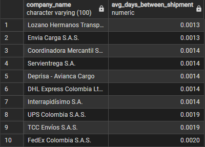

## c)

### En la siguiente línea de tiempo se muestran 3 envíos ficticios de una misma empresa con sus fechas `created_at` y los valores que devuelve LEAD:

```
Empresa: Envía Carga S.A.S.
──────────────────────────────────────────────────────────────────────
 Envío 1  │ created_at = 2024-01-01  │ LEAD → 2024-01-05  │ days = 4
           │                          │                     │
           │          apunta al siguiente ──────────────────┘
 Envío 2  │ created_at = 2024-01-05  │ LEAD → 2024-01-12  │ days = 7
           │                          │                     │
           │          apunta al siguiente ──────────────────┘
 Envío 3  │ created_at = 2024-01-12  │ LEAD → NULL        │ days = NULL
           │                          │   ↑
           │                    Última fila: no hay siguiente → NULL
──────────────────────────────────────────────────────────────────────
```

### `LEAD(created_at)` obtiene la fecha del siguiente envío dentro de la misma empresa. El último envío no tiene siguiente, por eso devuelve NULL.


## d)

### LAG vs LEAD: ambas funciones permiten acceder a filas adyacentes, pero en direcciones opuestas:

**Con LAG (mirando hacia atrás):**
```sql
SELECT
    ship_company_id,
    created_at,
    LAG(created_at) OVER (
        PARTITION BY ship_company_id
        ORDER BY created_at ASC, id ASC
    ) AS prev_shipment_date   -- NULL en la PRIMERA fila de cada empresa
FROM ship.shipment_orders;
```

**Con LEAD (mirando hacia adelante):**
```sql
SELECT
    ship_company_id,
    created_at,
    LEAD(created_at) OVER (
        PARTITION BY ship_company_id
        ORDER BY created_at ASC, id ASC
    ) AS next_shipment_date   -- NULL en la ÚLTIMA fila de cada empresa
FROM ship.shipment_orders;
```

### La diferencia principal:
- **LAG** accede a la fila anterior. `NULL` aparece en la **primera** fila de cada partición.
- **LEAD** accede a la fila siguiente. `NULL` aparece en la **última** fila de cada partición.
- Ambas consultas devuelven el mismo número de filas que la tabla original — ninguna "colapsa" el resultado.

---

# EJERCICIO 7. Patrón Top N — Productos más vendidos por categoría

## a)

```sql
WITH ranked_products AS (
    SELECT
        T3.name AS category_name,
        T2.name AS product_name,
        SUM(T1.quantity) AS total_units,
        RANK() OVER (
            PARTITION BY T3.id
            ORDER BY SUM(T1.quantity) DESC
        ) AS ranking
    FROM pay.order_items T1
    JOIN ctg.products   T2 ON T1.product_id  = T2.id
    JOIN ctg.categories T3 ON T2.category_id = T3.id
    GROUP BY T3.id, T3.name, T2.id, T2.name
)
SELECT
    category_name,
    product_name,
    total_units,
    ranking
FROM ranked_products
WHERE ranking <= 3
ORDER BY category_name, ranking ASC;
```

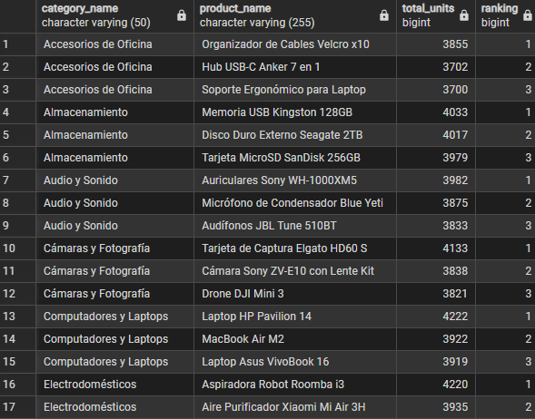
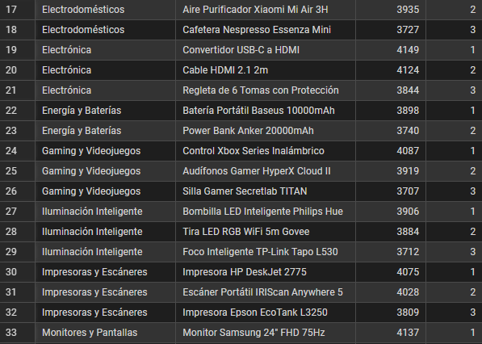
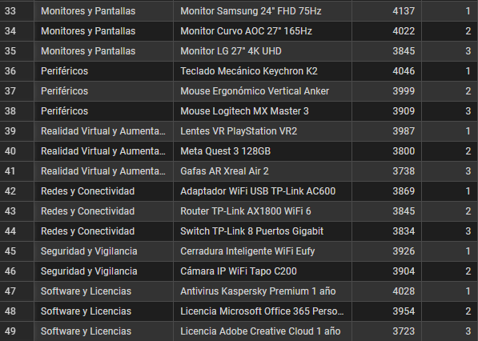
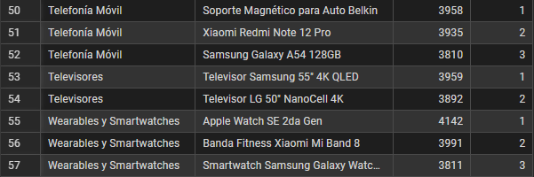


**Total de filas devueltas: 57** (algunas categorías tienen menos de 3 productos con ventas registradas).

## b)

### Al ejecutar la consulta, cada categoría debería tener máximo 3 filas. Si alguna categoría tiene más de 3 filas, la causa sería un **empate en el puesto 3**: `RANK()` asigna el mismo número de posición a valores iguales, por lo que si dos o más productos empatan en el tercer lugar, todos aparecerán con `ranking = 3`, generando más de 3 filas para esa categoría.

## c)

```sql
WITH ranked_products AS (
    SELECT
        T3.name AS category_name,
        T2.name AS product_name,
        SUM(T1.quantity) AS total_units,
        DENSE_RANK() OVER (
            PARTITION BY T3.id
            ORDER BY SUM(T1.quantity) DESC
        ) AS ranking
    FROM pay.order_items T1
    JOIN ctg.products   T2 ON T1.product_id  = T2.id
    JOIN ctg.categories T3 ON T2.category_id = T3.id
    GROUP BY T3.id, T3.name, T2.id, T2.name
)
SELECT
    category_name,
    product_name,
    total_units,
    ranking
FROM ranked_products
WHERE ranking <= 3
ORDER BY category_name, ranking ASC;
```

### Se debe usar **`DENSE_RANK()`** en lugar de `RANK()` cuando se quiere que, en caso de empate, todos los productos empatados aparezcan y el siguiente número de ranking no salte. `DENSE_RANK()` garantiza posiciones consecutivas (1, 2, 3…) sin huecos, mientras que `RANK()` puede generar saltos (1, 2, 3, 3, 5…).

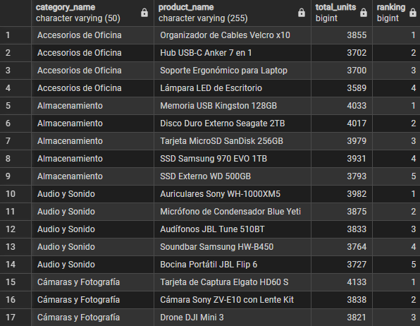
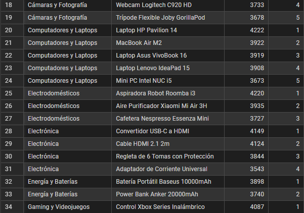
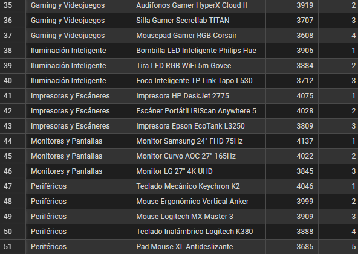
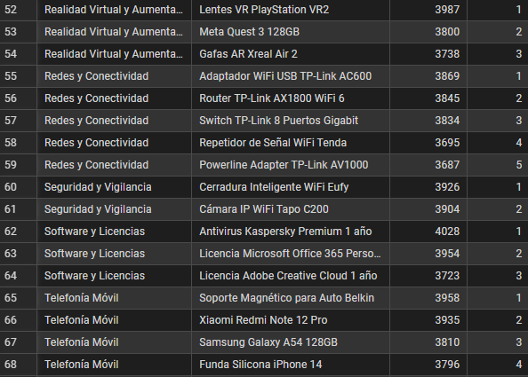
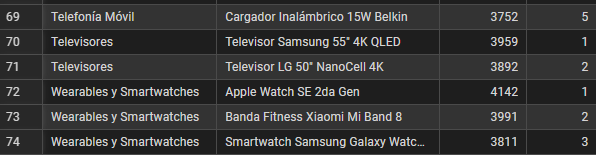

## d)

### Consulta generalizada con `top_n`:

```sql
WITH ranked_products AS (
    SELECT
        T3.name AS category_name,
        T2.name AS product_name,
        SUM(T1.quantity) AS total_units,
        RANK() OVER (
            PARTITION BY T3.id
            ORDER BY SUM(T1.quantity) DESC
        ) AS ranking
    FROM pay.order_items T1
    JOIN ctg.products   T2 ON T1.product_id  = T2.id
    JOIN ctg.categories T3 ON T2.category_id = T3.id
    GROUP BY T3.id, T3.name, T2.id, T2.name
)
SELECT
    category_name,
    product_name,
    total_units,
    ranking
FROM ranked_products
WHERE ranking <= 5   -- Top_N
ORDER BY category_name, ranking ASC;
```

### Documentación de filas por cada `top_n`:
- **top_n = 1:** 20 filas (exactamente 1 por cada una de las 20 categorías).
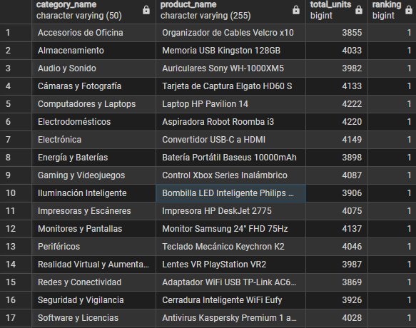
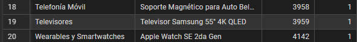
- **top_n = 3:** 57 filas (no 60, porque algunas categorías tienen menos de 3 productos con ventas).
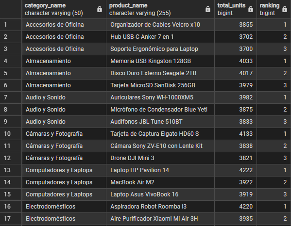
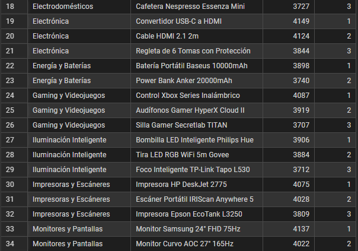
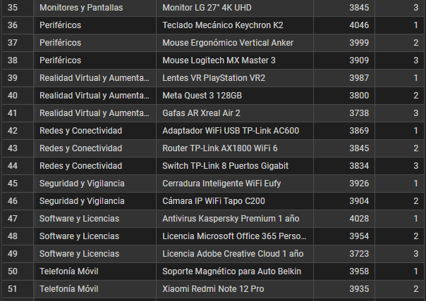
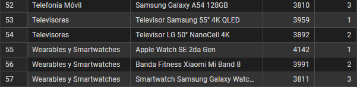

- **top_n = 5:** 74 filas (no 100, por la misma razón anterior).

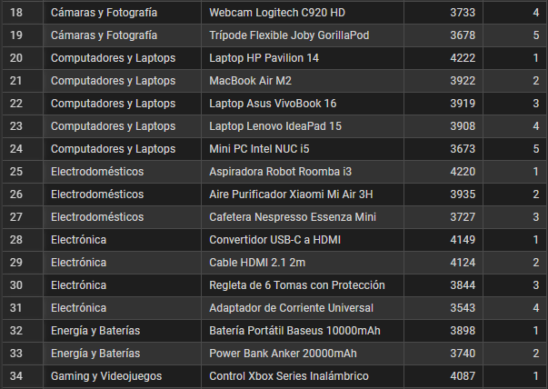
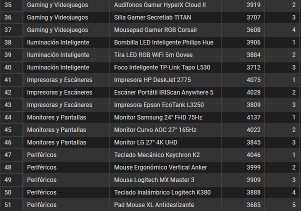
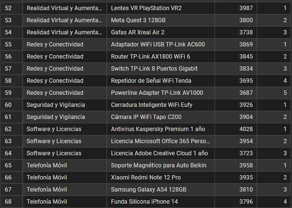
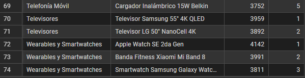

---

# EJERCICIO 8. Segmentación de clientes — Combinando funciones

## a)

```sql
-- CTE 1: solo agregados (GROUP BY)
WITH customer_stats AS (
    SELECT
        T1.id_number                       AS customer_id_number,
        COALESCE(SUM(T2.total), 0)         AS total_spent,
        COUNT(DISTINCT T2.id)              AS total_orders,
        MIN(T2.order_date)                 AS first_purchase,
        MAX(T2.order_date)                 AS last_purchase
    FROM cs.customers T1
    LEFT JOIN pay.orders T2
        ON T1.id_number = T2.customer_id_number
    GROUP BY T1.id_number
),
-- CTE 2: Window Function aplicada SOBRE la CTE anterior
customer_ranked AS (
    SELECT
        customer_id_number,
        total_spent,
        total_orders,
        first_purchase,
        last_purchase,
        ROW_NUMBER() OVER (
            ORDER BY total_spent DESC
        ) AS global_rank
    FROM customer_stats
)
SELECT
    T2.name AS customer_name,
    T1.customer_id_number,
    T1.total_spent,
    T1.total_orders,
    T1.first_purchase,
    T1.last_purchase,
    T1.global_rank,
    CASE
        WHEN T1.total_spent > 10000000 THEN 'VIP'
        WHEN T1.total_spent > 3000000  THEN 'Regular'
        WHEN T1.total_orders >= 1      THEN 'New'
        ELSE 'Inactive'
    END AS segment
FROM customer_ranked T1
JOIN cs.customers T2
    ON T1.customer_id_number = T2.id_number
ORDER BY T1.global_rank ASC;
```

> Se usan **dos CTEs separadas** siguiendo el patrón exigido por el taller: `customer_stats` calcula únicamente los agregados con `GROUP BY`, y `customer_ranked` aplica `ROW_NUMBER()` sobre el resultado ya agrupado. Esto garantiza que los niveles de agregación y de Window Function nunca coexistan en el mismo nivel de consulta. Se usa `LEFT JOIN` desde `cs.customers` para capturar también los clientes sin órdenes (segmento `Inactive`).

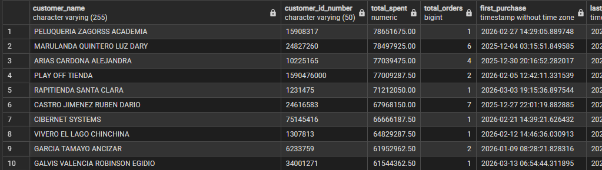
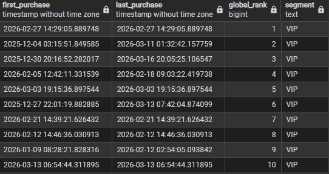

## b)

```sql
WITH customer_stats AS (
    SELECT
        T1.id_number AS customer_id_number,
        COALESCE(SUM(T2.total), 0) AS total_spent,
        COUNT(DISTINCT T2.id)      AS total_orders
    FROM cs.customers T1
    LEFT JOIN pay.orders T2
        ON T1.id_number = T2.customer_id_number
    GROUP BY T1.id_number
),
customers_segmented AS (
    SELECT
        CASE
            WHEN total_spent > 10000000 THEN 'VIP'
            WHEN total_spent > 3000000  THEN 'Regular'
            WHEN total_orders >= 1      THEN 'New'
            ELSE 'Inactive'
        END AS segment
    FROM customer_stats
)
SELECT
    segment,
    COUNT(*) AS total_customers
FROM customers_segmented
GROUP BY segment
ORDER BY total_customers DESC;
```

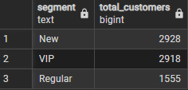

## c)

### Diagrama de distribución de clientes por segmento:

```
Cantidad de clientes
0          1.000       2.000       3.000
New      ██████████████████████████████ 2.928
VIP      █████████████████████████████ 2.918
Regular  ███████████████ 1.555
Inactive                                 0
```


## d)

```sql
-- CTE 1: solo agregados (GROUP BY)
WITH customer_stats AS (
    SELECT
        T1.id_number                       AS customer_id_number,
        COALESCE(SUM(T2.total), 0)         AS total_spent,
        COUNT(DISTINCT T2.id)              AS total_orders,
        MIN(T2.order_date)                 AS first_purchase,
        MAX(T2.order_date)                 AS last_purchase
    FROM cs.customers T1
    LEFT JOIN pay.orders T2
        ON T1.id_number = T2.customer_id_number
    GROUP BY T1.id_number
),
-- CTE 2: Window Function aplicada SOBRE la CTE anterior
customer_ranked AS (
    SELECT
        customer_id_number,
        total_spent,
        total_orders,
        first_purchase,
        last_purchase,
        ROW_NUMBER() OVER (
            ORDER BY total_spent DESC
        ) AS global_rank
    FROM customer_stats
)
SELECT
    T2.name AS customer_name,
    T1.total_spent,
    T1.total_orders,
    T1.first_purchase,
    T1.last_purchase,
    T1.global_rank
FROM customer_ranked T1
JOIN cs.customers T2
    ON T1.customer_id_number = T2.id_number
WHERE T1.total_spent > 10000000
ORDER BY T1.global_rank ASC;
```

### Total de clientes VIP en la base de datos: **4.732 clientes** tienen un `total_spent` mayor a $10.000.000.

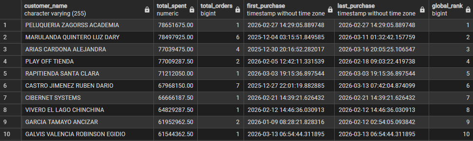

---

# EJERCICIO 9. Reporte integrador — La pregunta del jefe

### Preguntas a responder:
1. ¿Cuál fue la primera orden de cada cliente?
2. ¿Cuánto lleva gastado en total?
3. ¿En el mes más reciente **de ese cliente**, ¿se vendió más o menos que el mes anterior?

## a)

```sql
WITH first_order AS (
    -- ROW_NUMBER responde: ¿cuál fue la primera orden de cada cliente?
    SELECT
        customer_id_number,
        order_date AS first_order_date,
        total      AS first_order_total,
        ROW_NUMBER() OVER (
            PARTITION BY customer_id_number
            ORDER BY order_date ASC, id ASC
        ) AS rn
    FROM pay.orders
    WHERE customer_id_number IN ('10012568', '10024615936', '1002749014')
),
customer_totals AS (
    -- SUM GROUP BY responde: ¿cuánto lleva gastado en total?
    SELECT
        customer_id_number,
        SUM(total)         AS total_spent,
        COUNT(DISTINCT id) AS total_orders
    FROM pay.orders
    WHERE customer_id_number IN ('10012568', '10024615936', '1002749014')
    GROUP BY customer_id_number
),
monthly_by_customer AS (
    SELECT
        customer_id_number,
        DATE_TRUNC('month', order_date) AS month,
        SUM(total)                       AS monthly_revenue
    FROM pay.orders
    WHERE customer_id_number IN ('10012568', '10024615936', '1002749014')
    GROUP BY customer_id_number, DATE_TRUNC('month', order_date)
),
monthly_with_lag AS (
    -- LAG responde: ¿el mes más reciente de ESTE cliente vendió más o menos que el anterior?
    SELECT
        customer_id_number,
        month,
        monthly_revenue                              AS current_month_sales,
        LAG(monthly_revenue) OVER (
            PARTITION BY customer_id_number          -- LAG particionado por cliente
            ORDER BY month ASC
        )                                            AS prev_month_sales,
        ROW_NUMBER() OVER (
            PARTITION BY customer_id_number
            ORDER BY month DESC
        )                                            AS rn
    FROM monthly_by_customer
)
SELECT
    T4.name                                                    AS customer_name,
    T1.first_order_date,
    T1.first_order_total,
    T2.total_spent,
    T2.total_orders,
    T3.current_month_sales,
    COALESCE(T3.prev_month_sales, 0)                           AS prev_month_sales,
    T3.current_month_sales - COALESCE(T3.prev_month_sales, 0)  AS difference
FROM first_order T1
JOIN customer_totals  T2 ON T1.customer_id_number = T2.customer_id_number
JOIN monthly_with_lag T3 ON T1.customer_id_number = T3.customer_id_number
                         AND T3.rn = 1
JOIN cs.customers     T4 ON T1.customer_id_number = T4.id_number
WHERE T1.rn = 1;
```

> **Corrección clave:** el `LAG()` en `monthly_with_lag` ahora usa `PARTITION BY customer_id_number`, lo que garantiza que la comparación mensual sea individual por cliente. Cada cliente compara su último mes contra **su** mes anterior, no contra el global del negocio. Esto produce valores de `current_month_sales`, `prev_month_sales` y `difference` distintos para cada cliente.

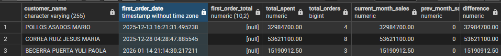

## b)

### Documentación de las CTEs:


**1. CTE `first_order`:**
- Usa **`ROW_NUMBER()`** para identificar la primera orden de cada cliente.
- `PARTITION BY customer_id_number` agrupa por cliente. `ORDER BY order_date ASC` ordena cronológicamente para obtener la más antigua.

**2. CTE `customer_totals`:**
- Usa funciones de agregación simples (`SUM`, `COUNT`) con `GROUP BY`.
- Calcula `total_spent` y `total_orders` por cliente.

**3. CTE `monthly_by_customer` + `monthly_with_lag`:**
- Agrupa ventas por cliente y mes, luego aplica **`LAG()`** particionado por cliente.
- Esto garantiza que cada cliente compare su mes más reciente contra **su propio** mes anterior, no contra el global del negocio.

## c)

### Versión sin Window Functions:

```sql
WITH first_order AS (
    -- Primera orden: subconsulta correlacionada en lugar de ROW_NUMBER
    SELECT
        o1.customer_id_number,
        o1.order_date AS first_order_date,
        o1.total      AS first_order_total
    FROM pay.orders o1
    WHERE o1.order_date = (
        SELECT MIN(o2.order_date)
        FROM pay.orders o2
        WHERE o2.customer_id_number = o1.customer_id_number
    )
    AND o1.customer_id_number IN ('10012568', '10024615936', '1002749014')
),
customer_totals AS (
    SELECT
        customer_id_number,
        SUM(total)         AS total_spent,
        COUNT(DISTINCT id) AS total_orders
    FROM pay.orders
    WHERE customer_id_number IN ('10012568', '10024615936', '1002749014')
    GROUP BY customer_id_number
),
monthly_sales AS (
    SELECT
        customer_id_number,
        DATE_TRUNC('month', order_date) AS month,
        SUM(total)                       AS monthly_sales
    FROM pay.orders
    WHERE customer_id_number IN ('10012568', '10024615936', '1002749014')
    GROUP BY customer_id_number, DATE_TRUNC('month', order_date)
),
last_month_per_customer AS (
    -- Mes más reciente de cada cliente: MAX sin Window Function
    SELECT customer_id_number, MAX(month) AS last_month
    FROM monthly_sales
    GROUP BY customer_id_number
),
monthly_comparison AS (
    -- Comparación mes actual vs anterior: self-join en lugar de LAG
    SELECT
        m1.customer_id_number,
        m1.monthly_sales AS current_month_sales,
        m2.monthly_sales AS prev_month_sales,
        m1.monthly_sales - COALESCE(m2.monthly_sales, 0) AS difference
    FROM monthly_sales m1
    JOIN last_month_per_customer lm
        ON m1.customer_id_number = lm.customer_id_number
       AND m1.month = lm.last_month
    LEFT JOIN monthly_sales m2
        ON m1.customer_id_number = m2.customer_id_number
       AND m2.month = m1.month - INTERVAL '1 month'
)
SELECT
    T4.name AS customer_name,
    T1.first_order_date,
    T1.first_order_total,
    T2.total_spent,
    T2.total_orders,
    T3.current_month_sales,
    COALESCE(T3.prev_month_sales, 0) AS prev_month_sales,
    T3.difference
FROM first_order T1
JOIN customer_totals      T2 ON T1.customer_id_number = T2.customer_id_number
JOIN monthly_comparison   T3 ON T1.customer_id_number = T3.customer_id_number
JOIN cs.customers         T4 ON T1.customer_id_number = T4.id_number;
```

### Conteo de líneas de código:
- **Versión con Window Functions:** ~45 líneas — una CTE por pregunta, funciones de ventana inline.
- **Versión sin Window Functions:** ~58 líneas — subconsulta correlacionada para primera orden, CTE adicional para `last_month_per_customer` y self-join para comparación mensual.
- **Diferencia:** ~13 líneas adicionales, pero más importante: la versión sin WF lee `pay.orders` 4–5 veces vs 3 veces con WF.

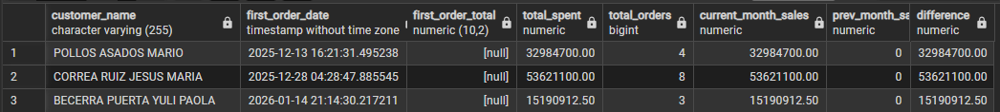

## d)

### Análisis de lecturas de tabla:

**Versión sin Window Functions:**
- `pay.orders` se lee en la subconsulta correlacionada de `first_order` (**2 veces**: una para la fila principal y una por cada ejecución correlacionada).
- Se lee **1 vez** en `customer_totals`.
- Se lee **1 vez** en `monthly_sales`.
- Se lee **1 vez** adicional en el self-join de `monthly_comparison`.
- **Total: aproximadamente 4–5 lecturas de `pay.orders`.**

**Versión con Window Functions:**
- Se lee **1 vez** en `first_order`.
- Se lee **1 vez** en `customer_totals`.
- Se lee **1 vez** en `monthly_by_customer`.
- **Total: 3 lecturas de `pay.orders`.**

### Impacto según el tamaño de la tabla:

- **Con 16.258 registros:** La diferencia es mínima, el tiempo de respuesta es similar.
- **Con 16.000.000 de registros:** Cada lectura adicional implica más I/O, memoria y CPU. La subconsulta correlacionada de `first_order` puede ejecutarse una vez por cada cliente filtrado, lo que puede representar diferencias de segundos a minutos en tiempo de ejecución.


---

# EJERCICIO 10. Diseño propio — Caso de uso libre

## a)

### Caso de uso propuesto:
**Análisis de frecuencia de compra por cliente:** determinar para cada cliente, ordenado por su fecha de compra, el tiempo transcurrido desde su compra anterior. Esto permite identificar clientes frecuentes vs clientes esporádicos y calcular el tiempo promedio entre compras por cliente para campañas de retención.

## b)

### Función a usar: **`LAG()`**

**Justificación:**
`LAG()` es la función adecuada porque permite acceder a la fecha de la orden anterior de cada cliente sin necesidad de hacer un self-join.

- **`PARTITION BY`:** `customer_id_number` — para agrupar las órdenes de cada cliente de forma independiente.
- **`ORDER BY`:** `order_date ASC` — para ordenar cronológicamente y que `LAG` obtenga la compra anterior en el tiempo.

## c)

```sql
WITH purchase_frequency AS (
    SELECT
        T1.customer_id_number,
        T2.name AS customer_name,
        T1.order_date,
        LAG(T1.order_date) OVER (
            PARTITION BY T1.customer_id_number
            ORDER BY T1.order_date ASC
        ) AS prev_order_date
    FROM pay.orders T1
    JOIN cs.customers T2 ON T1.customer_id_number = T2.id_number
)
SELECT
    customer_name,
    order_date,
    prev_order_date,
    ROUND(
        EXTRACT(EPOCH FROM (order_date - prev_order_date)) / 86400.0,
        2
    ) AS days_since_last_purchase
FROM purchase_frequency
WHERE customer_id_number IN ('10012568', '10024615936', '1002749014')
  AND prev_order_date IS NOT NULL
ORDER BY customer_name, order_date;
```

> **Corrección respecto a versión anterior:** se usa `EXTRACT(EPOCH FROM ...) / 86400.0` en lugar de `DATE_PART('day', ...)`. La resta de dos columnas `timestamp` en PostgreSQL devuelve un `interval`, y `DATE_PART('day', interval)` solo extrae la parte entera de días, truncando las horas. `EXTRACT(EPOCH FROM ...)` convierte el intervalo completo a segundos y dividir entre 86400 da los días con decimales precisos.

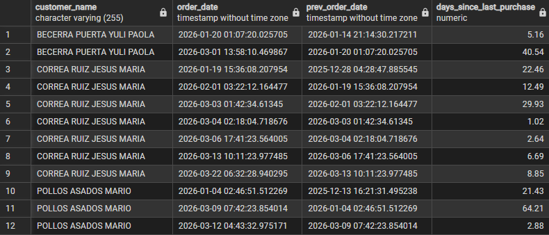

La primera orden de cada cliente muestra `prev_order_date = NULL` (excluida por el `WHERE`). Se puede observar que POLLOS ASADOS MARIO tiene un período de inactividad de **64.21 días** entre enero y marzo.

## d)

### Esquema de particiones:

```
PARTITION BY customer_id_number — cada bloque es un cliente independiente

┌══════════════════════════════════════════════════════════════┐
│  Partición: POLLOS ASADOS MARIO (10012568)                   │
│  ┌─────────────┬─────────────┬─────────────┬─────────────┐  │
│  │  orden 1    │  orden 2    │  orden 3    │  orden 4    │  │
│  │ 2025-12-13  │ 2026-01-04  │ 2026-03-09  │ 2026-03-12  │  │
│  │ LAG = NULL  │ LAG = 21d   │ LAG = 64d   │ LAG = 3d    │  │
│  └─────────────┴─────────────┴─────────────┴─────────────┘  │
│              ORDER BY order_date ASC →                       │
└══════════════════════════════════════════════════════════════┘

┌══════════════════════════════════════════════════════════════┐
│  Partición: CORREA RUIZ JESUS MARIA (10024615936)            │
│  ┌─────────────┬─────────────┬─────────────┐                │
│  │  orden 1    │  orden 2    │  orden 3    │  ...           │
│  │ 2025-12-28  │ 2026-01-19  │ 2026-02-01  │                │
│  │ LAG = NULL  │ LAG = 22d   │ LAG = 12d   │                │
│  └─────────────┴─────────────┴─────────────┘                │
│              ORDER BY order_date ASC →                       │
└══════════════════════════════════════════════════════════════┘
```

### Cada rectángulo representa un grupo formado por `PARTITION BY customer_id_number`. Las flechas muestran el orden interno (`ORDER BY order_date ASC`) y los valores que calcula `LAG()`. El `NULL` siempre aparece en la primera fila de cada partición porque no existe compra anterior.


## e)

### Reflexión final:

Sin Window Functions, para resolver el mismo caso habría que:

1. Asignar un número de fila a cada orden por cliente mediante una subconsulta correlacionada que cuente cuántas órdenes anteriores tiene cada fila (simulando `ROW_NUMBER`).
2. Hacer un self-join de `pay.orders` consigo misma, uniendo cada orden (fila `n`) con la orden de número anterior del mismo cliente (fila `n-1`).
3. Calcular la diferencia de fechas entre las dos filas del join.
4. Filtrar las filas donde el número de posición del join sea exactamente una unidad menor.

**Con Window Functions:** la solución es más directa, legible y eficiente. Una sola pasada por los datos con `LAG()` reemplaza múltiples joins y subconsultas correlacionadas. La simplificación es significativa: de aproximadamente 20–25 líneas de código complejo a 10 líneas claras y mantenibles. Además, el self-join lee `pay.orders` dos veces; `LAG()` lo hace una sola vez.


