# BDI-II-U1-VIEWS-CODIGO.md

Este documento contiene la resolución del taller de Vistas para la asignatura Bases de Datos II.

---

## Ejercicio 1. Vista normal — Detalle completo de órdenes

**a) Crear la vista `cs.v_order_detail`**

```sql
CREATE VIEW cs.v_order_detail AS
SELECT 
    T1.name AS customer_name,
    T1.email,
    T2.id AS order_id,
    T2.order_date,
    T4.name AS product_name,
    T3.quantity,
    T4.usd_price AS unit_price_usd,
    T4.cop_price AS unit_price_cop,
    (T3.quantity * T4.usd_price) AS subtotal_usd,
    (T3.quantity * T4.cop_price) AS subtotal_cop
FROM cs.customers T1
INNER JOIN pay.orders T2 ON T1.id_number = T2.customer_id_number
INNER JOIN pay.order_items T3 ON T2.id = T3.order_id
INNER JOIN ctg.products T4 ON T3.product_id = T4.id;
```

**Image 1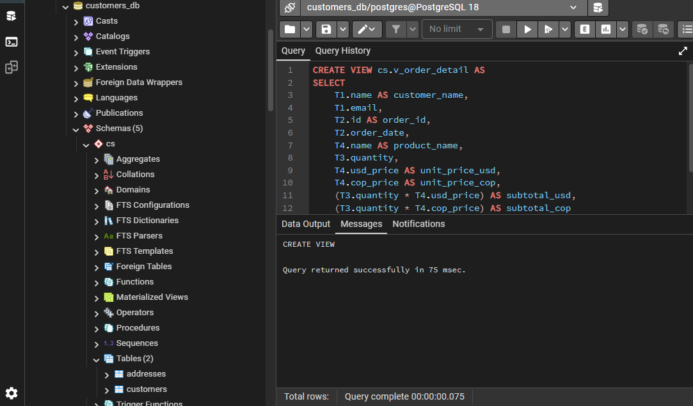**

**b) Consultar la vista filtrando por un `order_id` específico**

```sql
SELECT * FROM cs.v_order_detail 
WHERE order_id = 'ORD-001'; 
```
**Image 2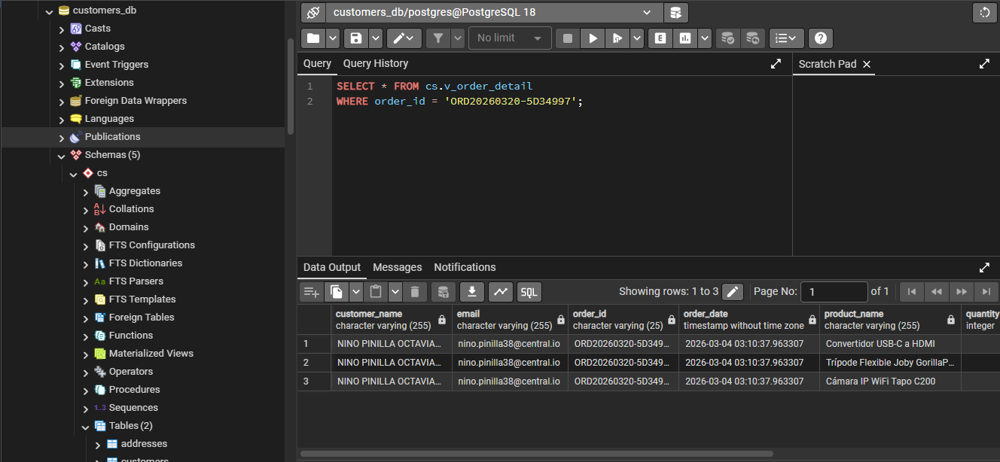**

**c) Consultar la vista ordenando por fecha de orden de manera descendente**

```sql
SELECT * FROM cs.v_order_detail 
ORDER BY order_date DESC;
```
**Image 3 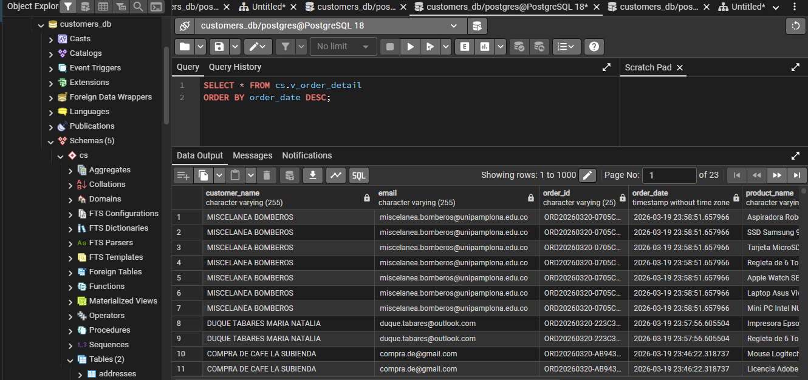**


---

## Ejercicio 2. Vista normal — Resumen por cliente

**a) Crear la vista `cs.v_customer_summary`**

```sql
CREATE VIEW cs.v_customer_summary AS
SELECT 
    T1.name AS customer_name,
    T1.email,
    COUNT(T2.id) AS total_orders,
    COALESCE(SUM(T2.total), 0) AS total_spent_usd,
    MAX(T2.order_date) AS last_purchase
FROM cs.customers T1
LEFT JOIN pay.orders T2 ON T1.id_number = T2.customer_id_number
GROUP BY T1.id_number, T1.name, T1.email;
```
**Image 4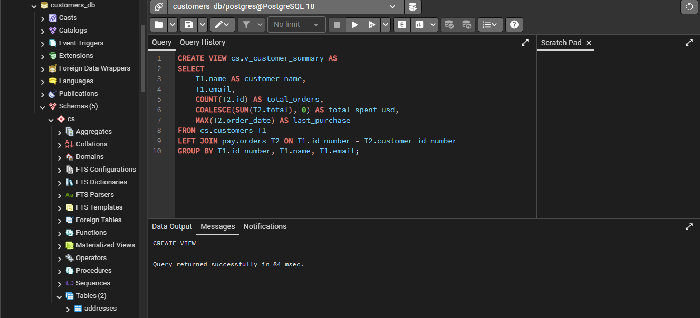**

**b) Consultar la vista ordenando por total gastado de mayor a menor**

```sql
SELECT * FROM cs.v_customer_summary 
ORDER BY total_spent_usd DESC;
```
**Image 5 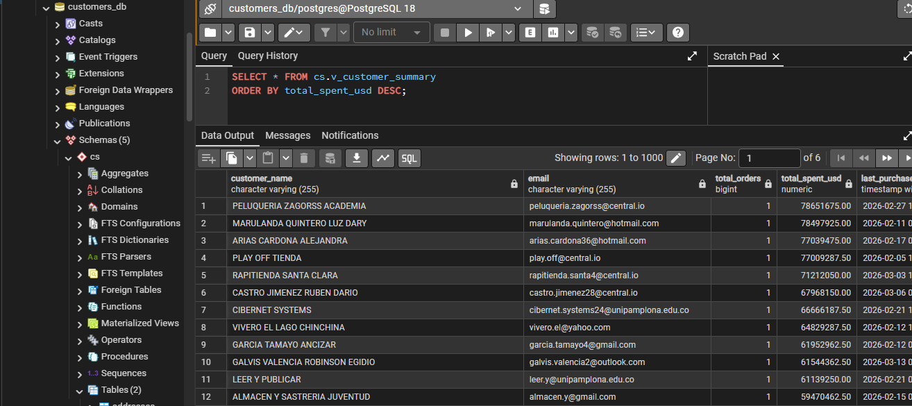**

**c) Consultar únicamente los clientes que tienen al menos una orden registrada**

```sql
SELECT * FROM cs.v_customer_summary 
WHERE total_orders > 0;
```
**Image 6 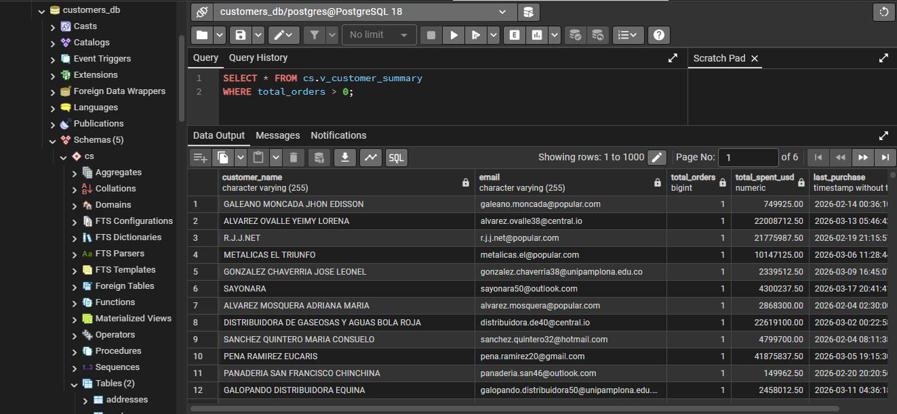**


---

## Ejercicio 3. Vista normal — Productos con su categoría

**a) Crear la vista `cs.v_products_with_category`**

```sql
CREATE VIEW cs.v_products_with_category AS
SELECT 
    T1.id AS product_id,
    T1.name AS product_name,
    T1.usd_price,
    T1.cop_price,
    T2.name AS category_name
FROM ctg.products T1
LEFT JOIN ctg.categories T2 ON T1.category_id = T2.id;
```
**Image 7 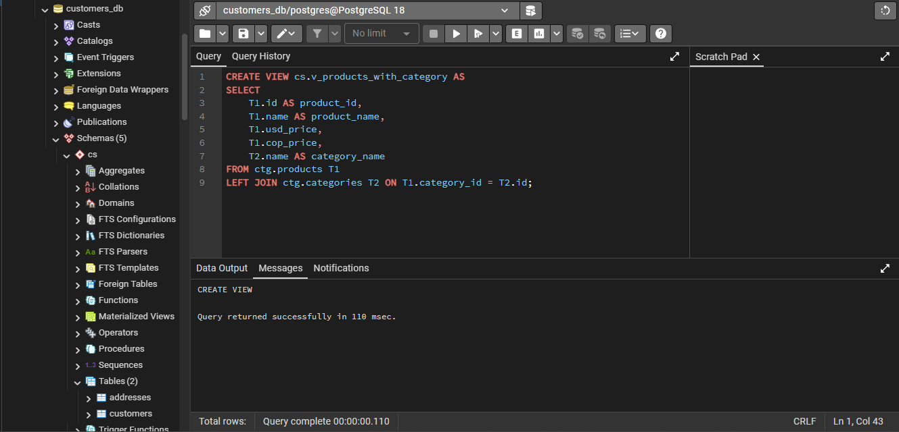**

**b) Consultar la vista filtrando únicamente los productos que sí tienen categoría asignada**

```sql
SELECT * FROM cs.v_products_with_category 
WHERE category_name IS NOT NULL;
```
**Image 8 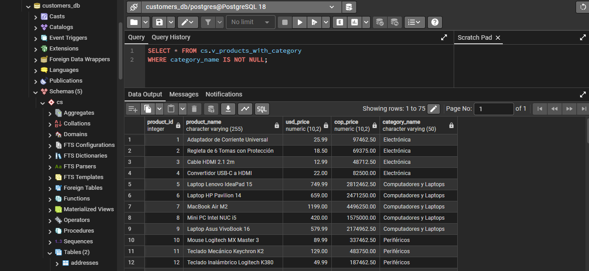**

**c) Consultar la vista ordenando por precio en USD de mayor a menor**

```sql
SELECT * FROM cs.v_products_with_category 
ORDER BY usd_price DESC;
```
**Image 9 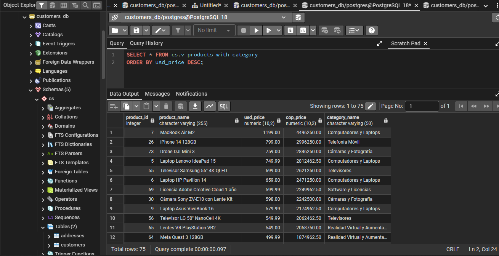**

---

## Ejercicio 4. Vista actualizable — Datos de contacto del cliente

**a) Crear la vista utilizando la cláusula `WITH CHECK OPTION`**

```sql
CREATE VIEW cs.v_customer_contact AS
SELECT 
    T1.id,
    T1.name,
    T1.email,
    T1.phone_number
FROM cs.customers T1
WITH CHECK OPTION;
```
**Image 10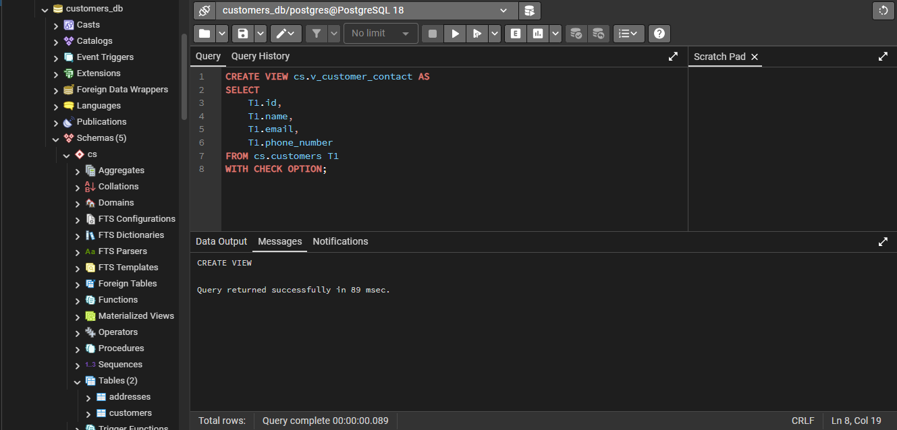**

**b) Realizar un UPDATE a través de la vista para modificar el número de teléfono**

```sql
UPDATE cs.v_customer_contact 
SET phone_number = '3001234567' 
WHERE id = 1;
```
**Image 11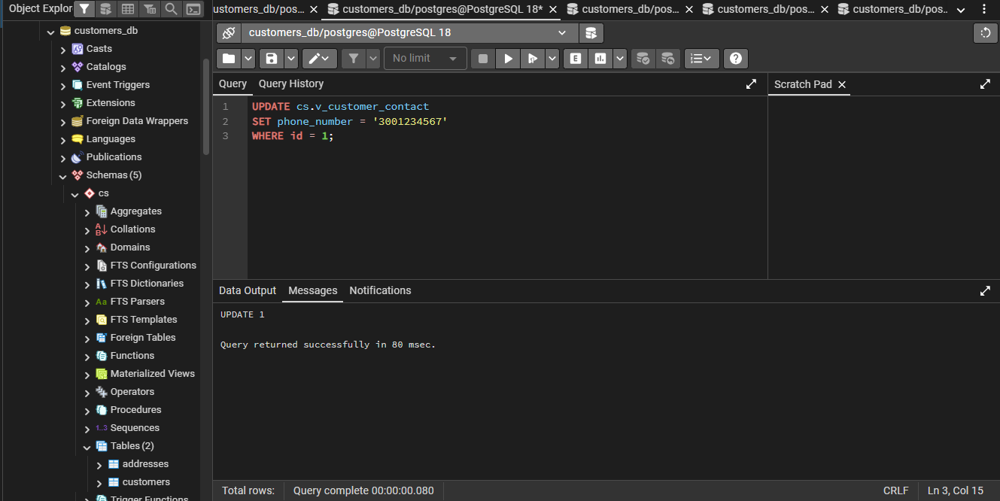**

**c) Verificar mediante un SELECT directo sobre `cs.customers`**

```sql
SELECT id, name, email, phone_number 
FROM cs.customers 
WHERE id = 1;
```
**Image 12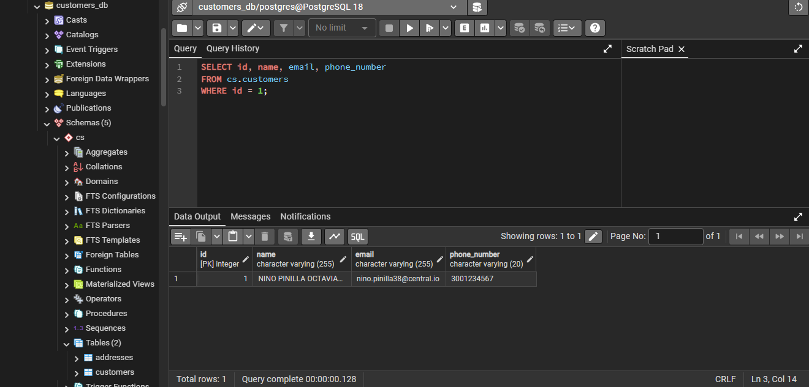**

**d) Explicación de `WITH CHECK OPTION`**

La cláusula `WITH CHECK OPTION` en una vista actualizable asegura que cualquier operación de `INSERT` o `UPDATE` ejecutada a través de la vista cumpla con la condición del `WHERE` de la propia vista (si tuviera uno). En este caso, como no hay un `WHERE`, actúa principalmente para proteger la integridad de las columnas expuestas. Si la vista tuviera un filtro como `WHERE email LIKE '%@gmail.com'`, intentar actualizar un correo a uno de `@outlook.com` lanzaría un error, impidiendo que la fila "desaparezca" de la propia vista tras la actualización.

---

## Ejercicio 5. Vista materializada — Ventas consolidadas por producto

**a) Crear la vista materializada `cs.mv_sales_by_product`**

```sql
CREATE MATERIALIZED VIEW cs.mv_sales_by_product AS
SELECT 
    T2.name AS product_name,
    SUM(T1.quantity) AS total_units_sold,
    SUM(T1.quantity * T2.usd_price) AS total_revenue_usd,
    SUM(T1.quantity * T2.cop_price) AS total_revenue_cop
FROM pay.order_items T1
INNER JOIN ctg.products T2 ON T1.product_id = T2.id
GROUP BY T2.id, T2.name;
```
**Image 13 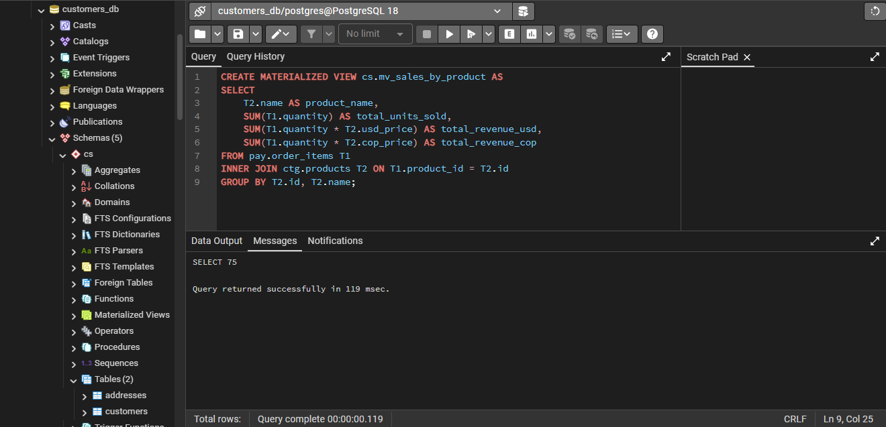**

**b) Consultar la vista y registrar el resultado inicial**

```sql
SELECT * FROM cs.mv_sales_by_product;
```
**Image 14 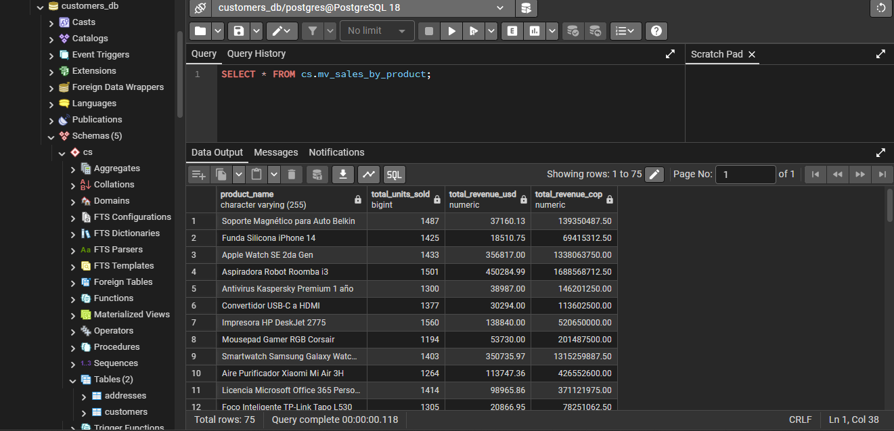**
**c) Insertar un nuevo `order_item` y verificar persistencia**

Si insertamos un nuevo registro en `pay.order_items`, el nuevo dato **no** se reflejará inmediatamente en la vista materializada. Esto se debe a que las vistas materializadas almacenan físicamente los datos en disco en el momento de su creación (o último refresco), actuando como un "snapshot" estático que no se vincula en tiempo real con la tabla base.

**Image 15 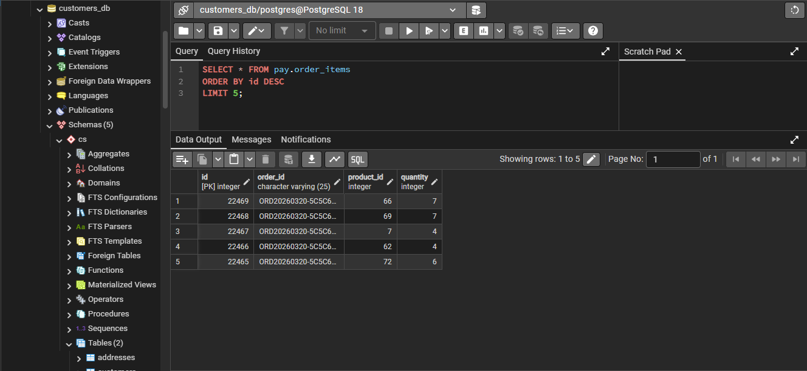**

**d) Ejecutar REFRESH y consultar nuevamente**


```sql
REFRESH MATERIALIZED VIEW cs.mv_sales_by_product;
SELECT * FROM cs.mv_sales_by_product;
```

**Image 16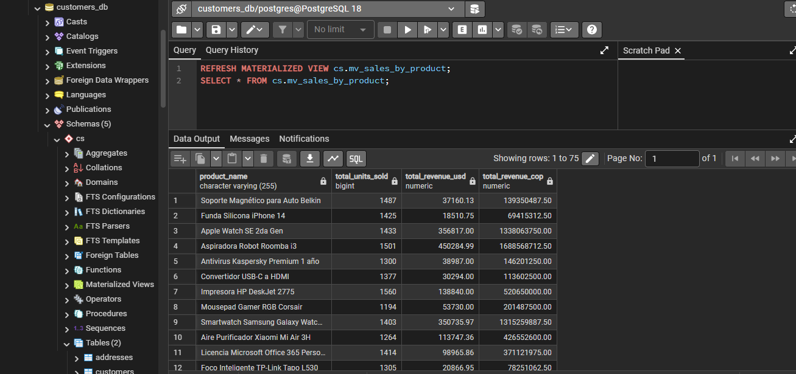**

---
## Ejercicio 6. Vista materializada — Segmentación de clientes

**a) Crear la vista materializada `cs.mv_customer_segments`**

```sql
CREATE MATERIALIZED VIEW cs.mv_customer_segments AS
SELECT 
    T1.name AS customer_name,
    T1.email,
    COUNT(T2.id) AS total_orders,
    COALESCE(SUM(T2.total), 0) AS total_spent_usd,
    CASE 
        WHEN COALESCE(SUM(T2.total), 0) > 800 THEN 'VIP'
        WHEN COALESCE(SUM(T2.total), 0) BETWEEN 300 AND 800 THEN 'Regular'
        WHEN COUNT(T2.id) > 0 AND COALESCE(SUM(T2.total), 0) < 300 THEN 'New'
        ELSE 'Inactive'
    END AS segment
FROM cs.customers T1
LEFT JOIN pay.orders T2 ON T1.id_number = T2.customer_id_number
GROUP BY T1.id_number, T1.name, T1.email;
```
**Image 17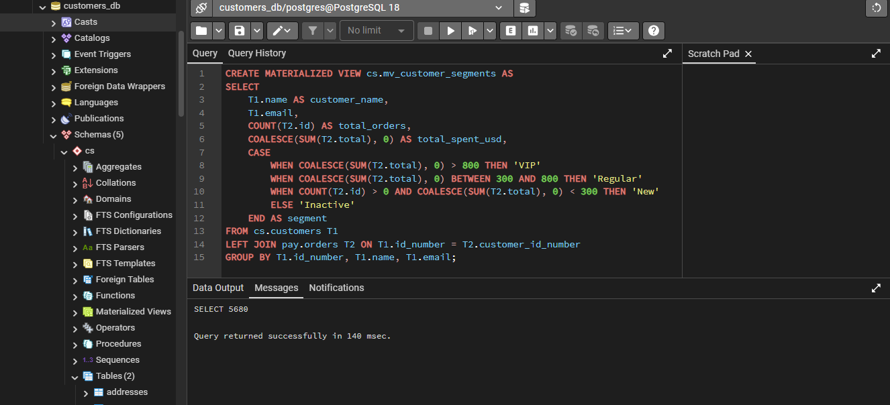**

**b) Consultar únicamente los clientes del segmento VIP**

```sql
SELECT * FROM cs.mv_customer_segments 
WHERE segment = 'VIP';
```
**Image 18 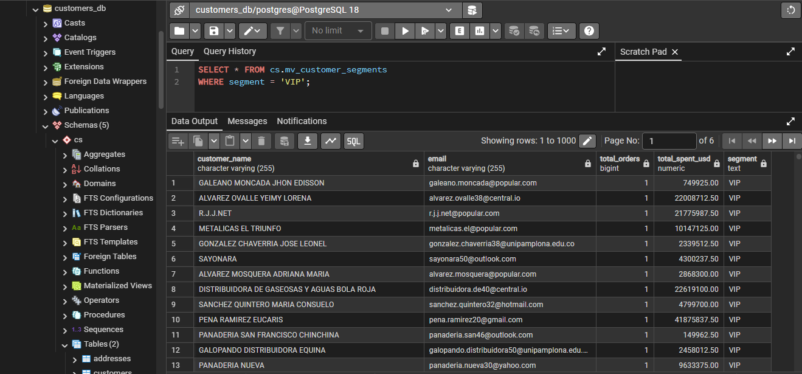**

**c) Consultar cuántos clientes hay en cada segmento**

```sql
SELECT segment, COUNT(*) AS customer_count 
FROM cs.mv_customer_segments 
GROUP BY segment;
```
**Image 19 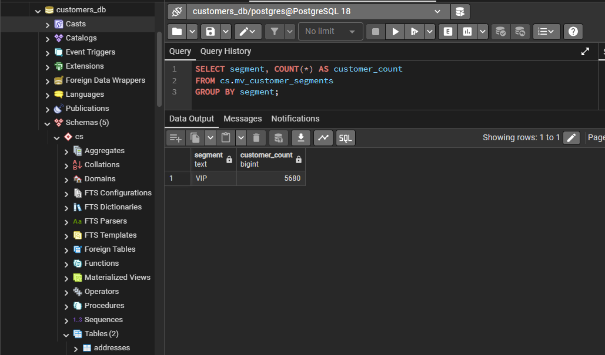**

---

## Ejercicio 7. Diseño — Vista recursiva

**a) Descripción del caso de uso**

En un entorno de comercio electrónico, los productos suelen pertenecer a categorías que están organizadas jerárquicamente (árbol de categorías). Por ejemplo: "Electrónica" > "Computación" > "Laptops". Una vista recursiva permite consultar toda la estructura de categorías, desde la raíz hasta el nivel más profundo, facilitando la navegación por el catálogo.

**b) Definición de la nueva tabla**

```sql
CREATE TABLE ctg.categories_hierarchy (
    id SERIAL PRIMARY KEY,
    name VARCHAR(100) NOT NULL,
    parent_id INT,
    FOREIGN KEY (parent_id) REFERENCES ctg.categories_hierarchy(id)
);
```

**c) Datos de ejemplo**

| id | name | parent_id |
|---|---|---|
| 1 | Electronics | NULL |
| 2 | Computing | 1 |
| 3 | Audio | 1 |
| 4 | Laptops | 2 |
| 5 | PC Components | 2 |
| 6 | Headphones | 3 |

**d) Nombre propuesto para la vista recursiva**

`cs.rv_categories_path`

**e) Descripción de los campos**

- `category_id`: Identificador de la categoría.
- `category_name`: Nombre de la categoría actual.
- `level`: Profundidad en el árbol (1 para raíz, 2 para hijos, etc.).
- `path`: La ruta completa desde la raíz hasta la categoría (ej: "Electronics / Computing / Laptops").

**f) Justificación**

Este caso no puede resolverse con una vista normal porque SQL estándar es iterativo, no permite autoreferencias sin saber de antemano el número de niveles de profundidad. Una vista recursiva utiliza una CTE recursiva para "recorrer" el árbol de forma dinámica hasta que no existan más hijos, permitiendo escalar a cualquier número de niveles de subcategorías sin cambiar la consulta.
